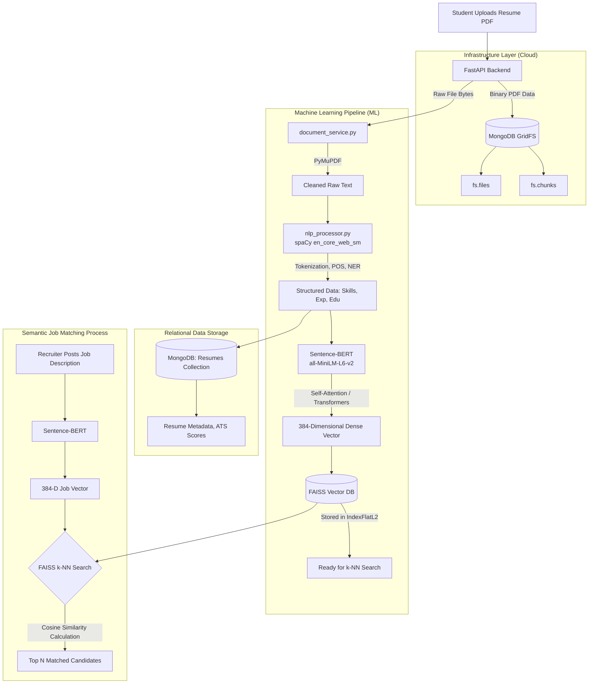

# Resume AI & Placement Platform: Architecture & ML Implementation

## 1. Complete System Architecture & Data Flow Chart

The following diagram illustrates the exact journey a resume takes from the moment a student uploads it, through the Machine Learning pipeline, and into the semantic matching engine.

---

## 2. In-Depth Machine Learning Flow (Step-by-Step)

The AI and ML pipeline is the core of this project. Below is a highly detailed breakdown of what happens under the hood at every stage of the flowchart above.

### Phase A: Ingestion & Storage (GridFS)
1. **The Request:** The user hits the `/api/v1/resumes/upload` endpoint with a `multipart/form-data` payload containing the PDF.
2. **Database Split:** The backend immediately splits the workload. The heavy binary data of the PDF is sent to **MongoDB GridFS**. GridFS slices the file into 255KB chunks, storing the metadata in `fs.files` and the binary pieces in `fs.chunks`. This bypasses the standard 16MB MongoDB document limit and ensures we don't rely on external cloud storage (like AWS S3 or Cloudinary), reducing network latency and increasing data privacy.

### Phase B: Text Extraction & Normalization
1. **PyMuPDF (fitz):** The raw binary bytes of the PDF are passed to `PyMuPDF`. The engine parses the PDF layout, extracts the raw text blocks, and standardizes the encoding (UTF-8).
2. **Regex Cleaning:** Custom regex pipelines strip out invisible characters, normalize whitespaces, and remove corrupted ligatures (e.g., converting "fi" to "fi"). 
*   **Why this matters:** ML models are extremely sensitive to garbage characters. A clean string buffer is mandatory for accurate NLP tokenization.

### Phase C: Information Extraction via spaCy (Rule-Based & Statistical NLP)
The cleaned string is passed to `nlp_processor.py`, which leverages the `en_core_web_sm` model from **spaCy**.
1. **Dependency Parsing & POS Tagging:** spaCy converts the string into a "Doc" object. It assigns Part-of-Speech (POS) tags (Nouns, Verbs, Adjectives) and maps the syntactic dependency tree (how words relate to each other).
2. **Named Entity Recognition (NER):** It statistically identifies entities like `DATE`, `ORG` (Companies), and `PERSON`.
3. **Custom PhraseMatcher:** This is our proprietary engine. We inject a massive gazetteer (dictionary) containing thousands of technical skills, frameworks, and tools. spaCy's `PhraseMatcher` traverses the syntax tree and isolates contiguous spans of text matching these rules.
4. **The Output:** The raw text is officially transformed into a structured JSON object containing exact arrays of `skills`, `experience_blocks`, and `education`. This structured JSON is saved to the standard MongoDB `resumes` collection.

### Phase D: Semantic Vectorization via Sentence-BERT
We now have structured keywords, but we need the system to understand *context and meaning*.
1. **The Model:** We use the HuggingFace `sentence-transformers` library, specifically the `all-MiniLM-L6-v2` model.
2. **Self-Attention Mechanism:** The extracted text is passed through 6 transformer encoder layers. The model uses a "Self-Attention" mechanism to weigh the importance of every word relative to its surrounding words. It learns that in the context of web development, "React" is a library, not a physical reaction.
3. **The Output:** The output of the final layer is pooled (Mean Pooling) to generate a **384-dimensional dense vector**. This means the entire resume's technical identity is now represented purely by an array of 384 floating-point numbers.

### Phase E: Vector Storage & Semantic Search via FAISS
1. **The Index:** The 384-D vector is pushed into a **FAISS (Facebook AI Similarity Search)** index (`IndexFlatL2` or Inner Product). This index lives on the local disk of the backend server.
2. **The Search (Cosine Similarity):** When a recruiter uploads a Job Description (JD), that JD undergoes the exact same BERT process, becoming its own 384-D vector.
3. **k-Nearest Neighbors (k-NN):** FAISS executes a mathematical search. It calculates the **Cosine Similarity** (the angular distance) between the JD vector and every single Resume vector in the database.
4. **The Result:** Instead of checking if a resume has the exact word "Frontend", FAISS proves that the resume vector (containing "React, UI Design") is mathematically positioned right next to the JD vector (asking for "Frontend Developer"). It returns the highest scoring matches in milliseconds.

### Phase F: Dynamic AI Interview Generation
The mock interview system leverages the intersection of the parsed NLP data and the job description.
1. **Data Intersection:** The backend identifies which specific skills from the student's spaCy-extracted `skills` array matched the JD vector requirements.
2. **Context Mapping:** It searches the `experience_blocks` array for those specific skills to establish *how* the student used them (e.g., "Deployed Docker containers on AWS").
3. **Prompt Engineering:** It feeds this exact context into a generative prompt template. The output is a highly personalized interview question: *"I see you deployed Docker containers on AWS in your last project. Can you explain how you handled container orchestration?"* 
4. **The Result:** We bypass generic, static HR questions and automatically generate deep, technical, candidate-specific interview scenarios.

---

## 3. How to Handle the Review Panel (Defense Strategy)

### The Situation
You have built an incredibly complex core engine, but some secondary features (and cloud deployment) are unfinished. Panel members will ask about the missing parts.

### The Strategy: "Focus on the Core Engine"

**1. Control the Narrative**
Do not start by apologizing for what isn't done. Start by showcasing the massive technical complexity of what *is* done. The integration of FastAPI, MongoDB GridFS, spaCy, BERT, and FAISS is a heavy engineering lift. Emphasize that you spent your time building a **robust, production-ready AI pipeline** rather than rushing out a buggy cloud deployment. Show them the Mermaid flowchart!

**2. Frame Unfinished Work as "Phase 2"**
When asked about cloud deployment or missing UI features, use software engineering terminology. 
*   *"We adopted an agile methodology. Phase 1 was strictly focused on building a secure, local infrastructure with a highly accurate Machine Learning pipeline. Deploying to AWS/GCP and adding [Feature X] is scoped for Phase 2."*

**3. Turn "Missing Cloudinary" into an Architectural Win**
If they ask why you aren't using cloud storage (Cloudinary) yet:
*   *"During development, we realized relying on third-party APIs for sensitive resumes introduced latency and security risks. I made the architectural decision to pivot and implement MongoDB GridFS. This keeps our file storage and database queries in the same ecosystem, reducing network calls and increasing security."* This proves you can make high-level technical pivots.

**4. Be Honest but Confident**
If they point out a button that doesn't work:
*   *"That feature is currently mocked out in the UI. The database schema for it is prepared, but we prioritized the Semantic Match engine (BERT + FAISS) for this sprint to ensure the core value proposition of the project was mathematically sound."*

**The golden rule:** Own your architectural decisions. You prioritized a working AI engine and a secure local database over superficial cloud deployments. Stand by that choice!
